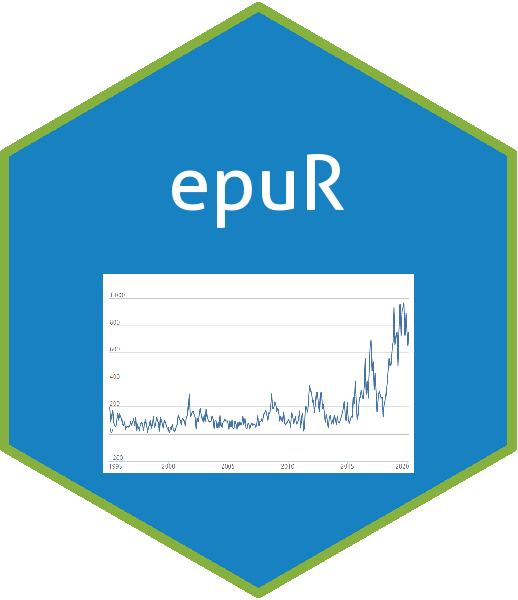

<!-- README.md is generated from README.Rmd. Please edit that file -->

```{r, include = FALSE}
knitr::opts_chunk$set(
  collapse = TRUE,
  comment = "#>",
  fig.path = "man/figures/README-",
  out.width = "100%"
)
```

# epuR



<!-- badges: start -->
[](https://travis-ci.org/Lingbing/epuR)
[](https://cran.r-project.org/package=epuR)
[](https://cran.r-project.org/package=epuR)
[](https://cran.r-project.org/package=epuR)


[](http://hits.dwyl.com/lingbing/epuR)
<!-- badges: end -->

The goal of `epuR` is to provide a simple and consistent framework to collect Economic Policy Uncertainty and related index data from their official web locations in real time. The official website of EPU is https://www.policyuncertainty.com/china_monthly.html.

## Installation

You can install the released version of `epuR` from [CRAN](https://CRAN.R-project.org) with:

``` r
install.packages("epuR")
```

And the development version from [GitHub](https://github.com/) with:

``` r
# install.packages("devtools")
devtools::install_github("Lingbing/epuR")
```
## Example

`epuR` functions adopts a **get_XXX()** style to collect the index data, where 'XXX' refers to the index name. For example, to get the Economic Policy Uncertainty (EPU) index, use function `get_EPU()`:

```{r example}
library(epuR)
## get EPU data
epu_data <- get_EPU()
class(epu_data)
```

Every `get` function returns an `xts` time series object so that further data manipulation and visualization is very straightforward if you are familiar with operations on `xts`. To plot all regions in the EPU data:

```{r cars}
plot(epu_data)
```

To plot some specific region:
```{r}
plot(epu_data$Australia)
```

## Using `dygraphs`

`dygraphs` can be directly use to make the time series plot interactive:

```{r}
library(dygraphs)
dygraph(epu_data$China)
```


Currently, the following indexes are supported: 

## Supported Index

|  Function |          Index Data         | Default arguments |
|:---------:|:---------------------------:|-------------------|
| `get_EPU` | Economic Policy Uncertainty | region = "all"    |
| `get_EMV` | Equity Market Volatility    | all = T           |
| `get_FSI` | Financial Stress Indicator  | freq = "monthly"  |
| `get_GPR` | Geopolitical Risk Index     | type = 1          |
| `get_IRI` | Immigration Related Index   | region = "all"    |
| `get_TPU` | Trade Policy Uncertainty    | region = "China"  |
| `get_WUI` | World Uncertainty Index     | type = "F1"       |
| `get_OMI` | Oxford-Man Institute RV     | index = "AEX"     |

For example, to get the FSI data:
```{r}
fsi_data <- get_FSI()
dygraph(fsi_data)
```


