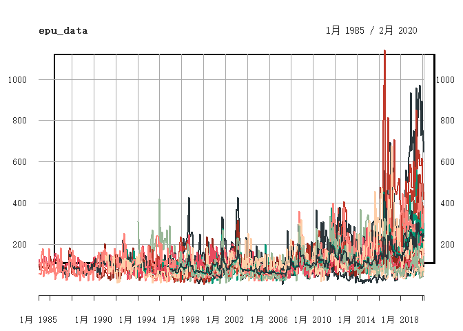

<!-- README.md is generated from README.Rmd. Please edit that file -->

# epuR


<!-- badges: start -->

[](https://travis-ci.org/Lingbing/epuR)
[](https://cran.r-project.org/package=epuR)
[](https://cran.r-project.org/package=epuR)
[](https://cran.r-project.org/package=epuR)


[](http://hits.dwyl.com/lingbing/epuR)
<!-- badges: end -->

The goal of `epuR` is to provide a simple and consistent framework to
collect Economic Policy Uncertainty and related index data from their
official web locations in real time.

The official websites are listed here:

Economic Policy
Uncertainty：<https://www.policyuncertainty.com/china_monthly.html>.

Trade Policy Uncertainty:
<https://www.matteoiacoviello.com/tpu.htm#data>

Oxford-Man Institute Realized Volatility:
<https://realized.oxford-man.ox.ac.uk/>

Geopolitical Risk Index: <https://www.matteoiacoviello.com/gpr.htm>

## Installation

You can install the released version of `epuR` from
[CRAN](https://CRAN.R-project.org) with:

``` r
install.packages("epuR")
```

And the development version from [GitHub](https://github.com/) with:

``` r
# install.packages("devtools")
devtools::install_github("Lingbing/epuR")
```

## Example

`epuR` functions adopts a **get\_XXX()** style to collect the index
data, where ‘XXX’ refers to the index name. For example, to get the
Economic Policy Uncertainty (EPU) index, use function `get_EPU()`:

``` r
library(epuR)
## get EPU data
epu_data <- get_EPU()
class(epu_data)
#> [1] "xts" "zoo"
```

Every `get` function returns an `xts` time series object so that further
data manipulation and visualization is very straightforward if you are
familiar with operations on `xts`. To plot all regions in the EPU data:

``` r
plot(epu_data)
```



To plot some specific region:

``` r
plot(epu_data$Australia)
```


## Using `dygraphs`

`dygraphs` can be directly employed to make the time series plot
interactive:

``` r
library(dygraphs)
dygraph(epu_data$China)
```


Currently, the following indexes are supported:

## Supported Index

| Function  |         Index Data          | Default arguments |
| :-------: | :-------------------------: | ----------------- |
| `get_EPU` | Economic Policy Uncertainty | region = “all”    |
| `get_EMV` |  Equity Market Volatility   | all = T           |
| `get_FSI` | Financial Stress Indicator  | freq = “monthly”  |
| `get_GPR` |   Geopolitical Risk Index   | type = 1          |
| `get_IRI` |  Immigration Related Index  | region = “all”    |
| `get_TPU` |  Trade Policy Uncertainty   | region = “China”  |
| `get_WUI` |   World Uncertainty Index   | type = “F1”       |
| `get_OMI` |   Oxford-Man Institute RV   | index = “AEX”     |

For example, to get the FSI data:

``` r
fsi_data <- get_FSI()
dygraph(fsi_data)
```


